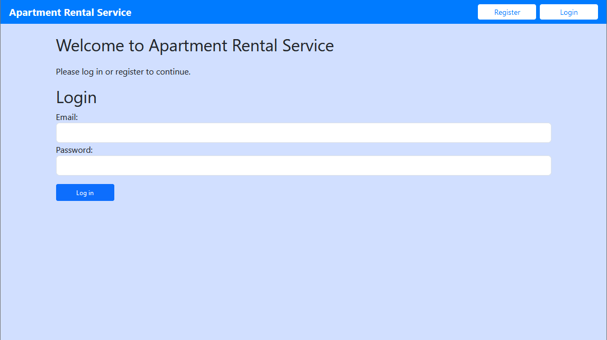
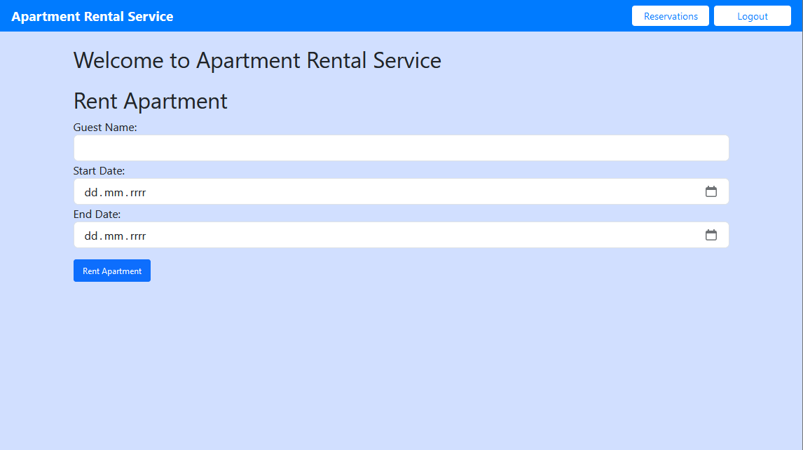
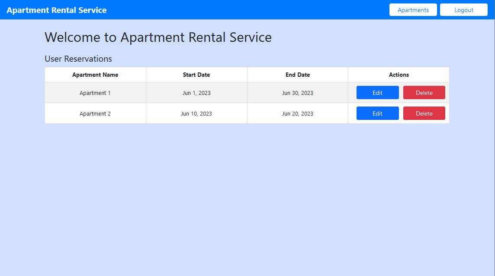
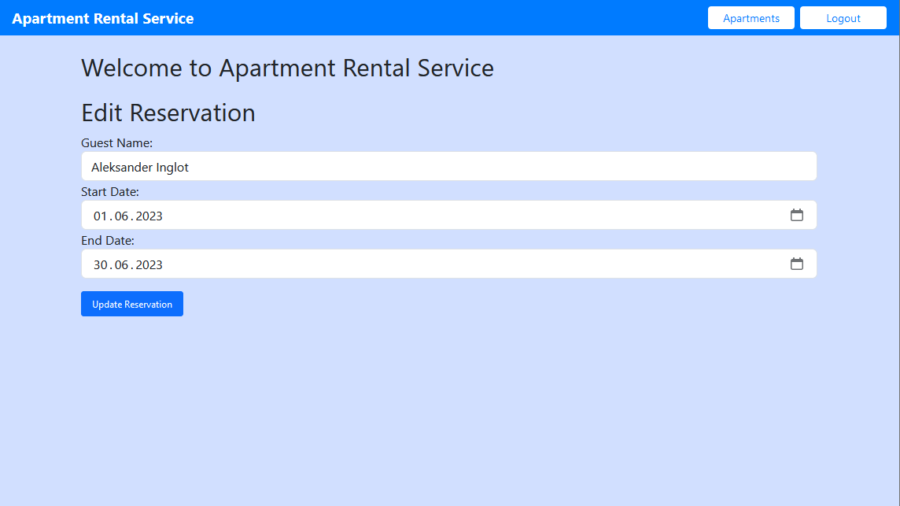

# Apartment Rental Service (Frontend)

Apartment Rental Service is a web application developed using Angular. It serves as the frontend part of the Apartment Rental Service, which allows users to register, log in, browse apartments for rent, rent apartments for specific dates, and manage their bookings.

## Features

The frontend application provides the following features:

- User registration and login: New users can create an account and log in to the application.
- List Apartments: Users can view a list of available apartments for rent.
- Rent Apartment: Users can rent an apartment for a specific range of dates.
- Manage Bookings: Users can view and manage their apartment bookings, including editing or canceling bookings.

## Technologies Used

- Angular
- TypeScript
- HTML
- CSS

## Backend Code

https://github.com/aleksanderinglot/apartment-rental-service

## Getting Started

These instructions will help you get a copy of the frontend project up and running on your local machine for development and testing purposes.

### Prerequisites

To run the frontend application, you need to have the following prerequisites installed on your system:

- Node.js: Make sure you have Node.js installed. You can download it from the official website: [Node.js](https://nodejs.org).

### Installation

Follow these steps to install and run the frontend application:

1. Clone the repository: `git clone https://github.com/aleksanderinglot/angular-apartment-rental-service.git`
2. Navigate to the project directory: `cd angular-apartment-rental-service`
3. Install dependencies: Run `npm install` to install the required dependencies.
4. Start the application: Run `ng serve` to start the application on the local development server.
5. Open a web browser and visit `http://localhost:4200` to access the application.

## Screenshots

Below are some screenshots of the frontend application:

